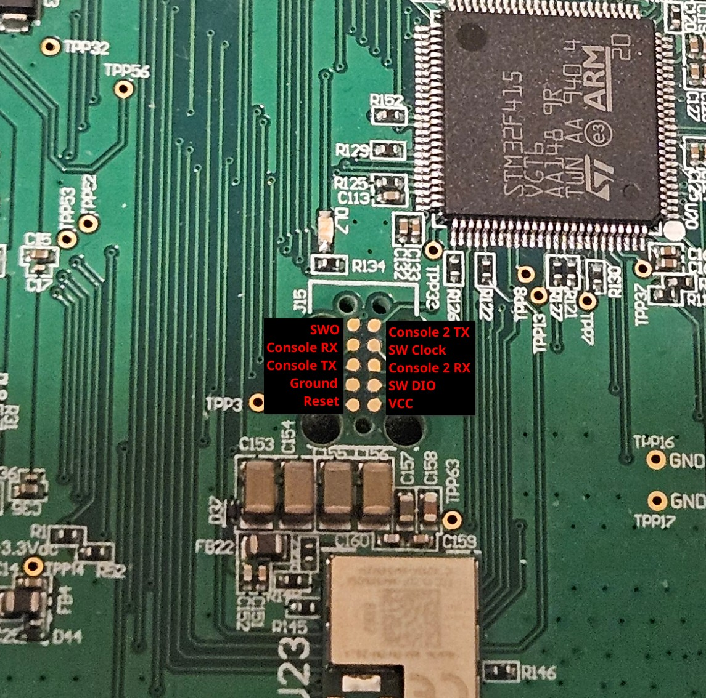
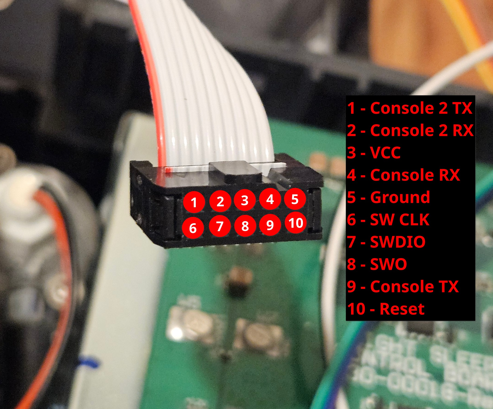

# Eight Sleep Firmware Tools

These tools will help modify the firmware of the Eight Sleep Pod 2 for local control. 

**They are provided as-is without warranty. Use at your own risk.**

## File List
1. `pod_tools.sh` - lets you dump and write firmware images to the pod using openocd
2. `firmware_tools.py` - modifies a dumped firmware image.  specify the path to the dumped firmware and then the path to the new server private key
3. `wifi_connect_tool.py` - lets you set new wifi credentials when pod is in pairing mode

## Step 0 - Requirements
*  Requirements for yourself
   1. ability to disassemble and reassemble the pod
   2. basic linux command line skills
   3. ability to follow technical instructions
*  Hardware Requirements
   1. a linux server that'll run 24/7
      * this will host the local control server.  
      * raspberry pis work great
   2. a linux computer to run the install scripts from 
      * this can be the same as the server, but it doesn't have to be.
   3. ST-Link v2 programmer 
      * knockoff versions are ok 
      * https://a.co/d/09KaGZY5
   4. Tag Connect adapter
      * https://www.digikey.com/en/products/detail/tag-connect-llc/TC2050-IDC/2605366
      * you can solder wires directly to the pod if you're brave
   5. dupont male to female hookup wires
      * https://a.co/d/04WGx90c
   6. (optional) USB to TTL Serial adapter for debugging output
      * https://a.co/d/0dfrfaUu
* Software Requirements
  * Server Computer
    1. docker
    2. docker-compose
    3. Disable firewall or allow tcp ports 5683, 1337, and 3000
    4. **set a static ip on the server computer** and/or use a dns record on your router
  * Installation Computer
    1. openocd
    2. python3
    3. python3-pycryptodome
    4. picocom (for serial monitoring, if desired)
  
## Step 1 - Disassemble the Pod
You need access to the PCB on the top.  There are a few guides online explaining how to do this. the pod2 is the closest to the pod3 
1. free-sleep directions: https://github.com/throwaway31265/free-sleep/blob/main/INSTALLATION.md#1-access-the-circuit-board
2. ninesleep directions: https://github.com/bobobo1618/ninesleep?tab=readme-ov-file#instructions
3. pod teardown video: https://www.youtube.com/watch?v=ia5bSLa0ERw

## Step 2 - Connect the ST-Link
There are two debug headers on the board.  Be sure to use the one between the big chip and the wifi module. Use of the Tag Connect cable is recommended over soldering wires directly.
There are 3 connections that are required for programming.  SWDIO, SWCLK, and Ground. Follow the pictures below.

  
 
  

Verify the connection works by running `./pod_tools.sh test`
If you want serial output, you can also connect the TX pin to a USB to TTL Serial adapter.  Make sure to connect the pod's Console TX to the adapter's RX! You can share the ground between the st-link and the serial adapter.
You can use `./pod_tools.sh console` to view the serial output with picocom

## Step 3 - Dump the Firmware
Use `./pod_tools.sh dump firmware_backup.pin` to dump the firmware to a file named `firmware_backup.bin`
Save a copy of this file somewhere safe! You must have it inorder to return to stock.

## Step 4 - Modify the Firmware
1. First copy the dumped firmware to a new file that will be modified. 
   * `cp firmware_backup.bin firmware_modified.bin`
2. Next create a new RSA private key for the server
   * `openssl genrsa -out server_private_key.pem 2048`
3. Next run the modify firmware script
   * `python3 firmware_tools.py firmware_modified.bin server_private_key.pem`
   * Follow the directions in the script. 

## Step 5 - Start the Server
1. Copy the server private key you generated earlier to the server computer into the main project folder
2. run `docker-compose up -d` to start the server.

## Step 6 - Flash the Modified Firmware
Use `./pod_tools.sh write firmware_modified.bin` to flash the modified firmware to the pod

## Step 7 - Modify Wifi Credentials (Optional)
If the pod needs to connect to a different wifi network, you can use the wifi connect tool instead of using the app.
1. Put the pod into pairing mode by holding the large button on the back for 15 seconds (or on the PCB) until the light starts blinking blue
2. Wait for the "Eight-XXXX" wifi network to appear on your installation computer and connect to it
3. Run the wifi connect tool `python3 wifi_connect_tool.py` and follow the directions

## Step 8 - Test FreeSleep
1. Using a browser, visit http://server_ip:3000 (replace server_ip with the static ip you set earlier)
2. You should see the FreeSleep dashboard.  You can now control the pod locally!
3. After you're ok with the setup, reassemble the pod